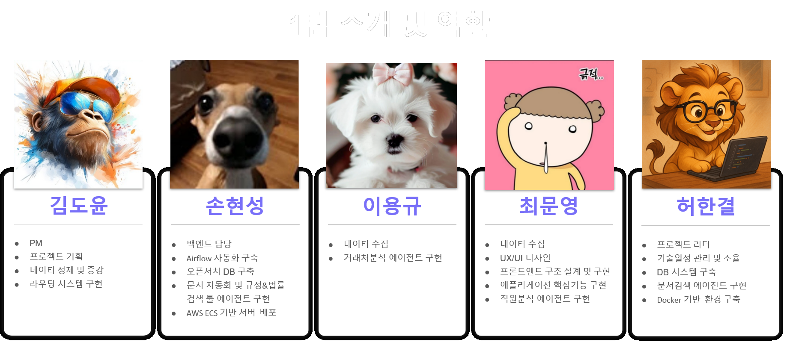
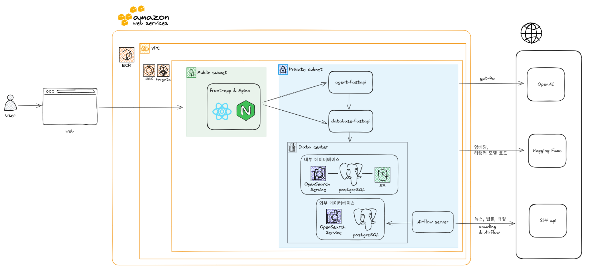
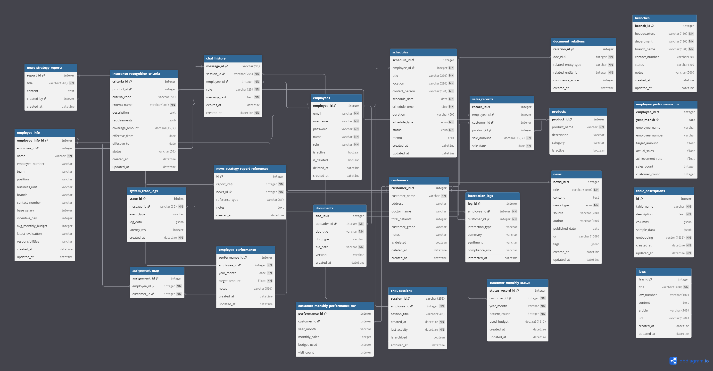

# NaruTalk : 일 잘하는 영업사원의 AI파트너
#### 제약영업사원 업무효율을 위한 문서검색 및 업무자동화 AI partner - llm기반 QA 챗봇<br/>
#### "LLM을 활용한 사내 문서 검색 및 업무지원형 디지털 비서 시스템"<br/>
##### 내 생각을 이해하고, 내 일을 함께하는 디지털 분신- 나루톡 <br/>
##### 모든 문서와 대화를 하나로 연결하는 스마트 허브 챗봇 - 나투록 <br/>
###### 나루톡 ( 모든 기능의 허브라는 뜻의 순우리말 '나룻터' 와 대화를 주고받는 talk의 합성어로,사용자의 모든 생각과 행동을 연결해주는 디지털 분신 챗봇 )

---

</div>

<table>
<tr>
 </div>
</table>    

</td>
</tr>

--- 
## I. 프로젝트 주제 - RAG 기반의 QA챗봇 개발</br></br>
1. 제약영업 업무 효율성 강화를 위한 RAG 기반 문서검색 QA 챗봇 </br>
- 사내 문서, 규정, 직원 정보부터 외부 최신 규제까지 통합 검색 가능</br>
- RAG 구조로 문서 신뢰도 확보 및 최신성 반영</br>
2. 제약영업사원 맞춤형 AI 비서 기능</br>
- 내부 문서 검색, 규정 검토, 실적 분석, 거래처 심층 분석을 한 번에 수행</br>
- 단순 정보 제공이 아닌, 질문에 기반한 데이터 분석 및 답변 제공</br>
- 실적 데이터 기반 맞춤형 질의응답 가능</br>
3. 현장 밀착형 AI 도입을 통한 업무 효율 증가</br>
- 영업사원이 고객과의 관계 형성에 집중할 수 있는 환경 조성</br>
- 규정 위반 사전 방지로 리스크 최소화</br>
- 반복 업무 감소 및 의사결정 지원으로 업무 효율 극대화</br>


---
## II. 프로젝트 기대효과</br></br>
1. 원클릭 문서자동생성·실시간 규정검토</br>
-  대화로 문서 자동생성·규정 즉시 체크</br>
-  작성/검토 시간 및 규정위반 가능성 대폭 감소</br>
2. 데이터 기반·객관평가형 직원 실적 분석</br>
-  직원·기간별 요약·추세·이슈 자동 도출</br>
-  평가가 객관화되고 우선순위가 선명</br>
3. 포텐셜 발굴·전략추천형 거래처 분석</br>
-  패턴/성장성 분석·등급화·타겟 추천</br>
-  자원 배분이 최적화 및 매출 창출</br>
4. 원스톱 통합 문서·정보 검색</br>
-  내부/외부 통합 검색·요약·출처 제공</br>
-  최신정보 습득 및 탐색시간 감소</br>

---
## III. 핵심 기능
1. AI를 통한 문서 자동 생성 및 규정 검토
- 챗봇 대화를 통해 문서 템플릿 자동 생성
- 규정 준수 여부 실시간 검토
2. AI를 통한 직원 실적 분석
- 실적 추이 및 패턴 분석
- 데이터 기반의 객관적 평가
3. AI를 통한 거래처 분석
- 거래처별 구매 패턴 분석
- 잠재 고객 타겟팅 레포팅
4. 원클릭 정보 검색
- 하이브리드 서치 및 리랭커 모델로 정확한 정보 검색
- Airflow기반의 실시간 문서 업데이트 및 검색
- 최신 보험 규정 및 이슈 검색

---  
</table>
  </p>
</div>
<h1> IV. 📚 STACKS</h1>

<!-- Backend & Language -->


<!-- Database & Search -->


<!-- AI & LLM -->


<!-- Embedding -->


<!-- DevOps & Deploy -->

[](https://aws.amazon.com/ec2/)
[](https://www.docker.com/)

<!-- Crawling & OAuth -->


<!-- Collaboration -->


</div>

---
## V. 📂 **프로젝트 구조**<br/>
```
Final_Git/
├── backend/                    # 백엔드 서버
│   ├── app/
│   │   ├── api/               # API 엔드포인트
│   │   ├── core/              # 핵심 설정
│   │   └── services/          # 에이전트
│   │       ├── router_agent/  # 라우터
│   │       ├── docs_agent/    # 문서 자동생성 및 규정위반체크 에이전트
│   │       ├── client_agent/  # 거래처 분석 에이전트
│   │       ├── employee_agent/# 직원 실적분석 에이전트
│   │       ├── search_agent/  # 정보검색 에이전트
│   │       ├── common/        # 공통 모듈
│   │       └── tools/         # 유틸리티 도구
│   ├── alembic/               # 데이터베이스 마이그레이션
│   └── Dockerfile
│
├── frontend/                   # 프론트엔드 클라이언트
│   ├── public/
│   ├── src/
│   │   ├── components/        # React 컴포넌트
│   │   ├── services/          # API 서비스
│   │   └── utils/             # 유틸리티 함수
│   └── Dockerfile
│  
├── database/                   # 데이터베이스 설정
│   ├── docker/                # Docker 구성
│   ├── docs/                  # API 문서
│   └── util_scripts/          # 유틸리티 스크립트
└── docker-compose.yml         # Docker Compose 설정
```
---
## VI. 시스템 아키텍처

</td>
</tr>

---
## VII. DB 스키마

</td>
</tr>

--- 

## 에이전트 기능
- **Router Agent**: 사용자 요청을 분석하여 적절한 에이전트로 라우팅
- **Docs Agent**: 문서 템플릿 기반 자동 생성 및 규정 검토
- **Client Agent**: 거래처 데이터 분석 및 보고서 생성
- **Employee Agent**: 직원 성과 데이터 조회 및 분석
- **Search Agent**: 하이브리드 검색 (키워드 + 벡터)
---
### API 구조
- **Agent Server (8000)**: 에이전트 API 제공
  - `/api/router/chat`: 메인 챗봇 엔드포인트
  - `/api/docs/*`: 문서 생성 API
  - `/api/client/*`: 거래처 분석 API
  - `/api/employee/*`: 직원 관리 API
---
- **Database API (8010)**: 데이터베이스 및 인프라 API
  - 사용자 인증/권한 관리
  - 문서 저장 및 검색
  - 대화 히스토리 관리
---
## 설치 및 실행

### 사전 요구사항
- Docker & Docker Compose
- Node.js 18+ (개발 모드)
- Python 3.11+ (개발 모드)

### 환경 변수 설정
`.env` 파일 생성:
```bash
# OpenAI
OPENAI_API_KEY=your_api_key

# Database
POSTGRES_USER=postgres
POSTGRES_PASSWORD=your_password
POSTGRES_DB=narutalk
POSTGRES_HOST=postgres
POSTGRES_PORT=5432

# MinIO
MINIO_ROOT_USER=minioadmin
MINIO_ROOT_PASSWORD=minioadmin
MINIO_ENDPOINT=minio:9000
MINIO_BUCKET_NAME=narutalk

# OpenSearch
OPENSEARCH_HOST=opensearch-node1
OPENSEARCH_PORT=9200
OPENSEARCH_INITIAL_ADMIN_PASSWORD=your_password

# JWT
JWT_SECRET_KEY=your_secret_key

# PgAdmin
PGADMIN_EMAIL=admin@example.com
PGADMIN_PASSWORD=admin
```

### Docker Compose 실행
```bash
# 데이터베이스 서비스 실행
cd database/docker
docker-compose up -d

# 메인 애플리케이션 실행
cd ../..
docker-compose up -d
```

### 접속 URL
- Frontend: http://localhost:3000
- Agent API: http://localhost:8000/docs
- Database API: http://localhost:8010/docs
- PgAdmin: http://localhost:5050
- MinIO Console: http://localhost:9001
- OpenSearch Dashboard: http://localhost:5601

## 개발 가이드

### 백엔드 개발
```bash
cd backend
pip install -r requirements.txt
python app/agent_server.py
```

### 프론트엔드 개발
```bash
cd frontend
npm install
npm start
```

### 테스트 실행
```bash
# Backend 테스트
cd backend
pytest

# Frontend 테스트
cd frontend
npm test
```
---
## 1팀 최종프로젝트 회고록

| 이름   | 한 줄 회고                                                                                                                                    |
| ------ | --------------------------------------------------------------------------------------------------------------------------------------------- |
| 김도윤 | 여러 차례의 기획과 협업 프로젝트를 통해 진로와 학습 방향을 구체화하고, 초기 계획에 맞춰 점진적인 성장을 이뤘습니다. 동기와 팀원의 협력을 통해 부족한 기초와 전문성을 보완했으며, 앞으로의 계획을 실행할 자신감과 지식을 쌓을 수 있었습니다. 이런 기회를 준 SK,엔코어,강사님,매니저님과 도움을 많이 준 12기 동기들에게 감사합니다. |
| 손현성 | 새로운 프레임워크를 활용해 기능을 구현하는 과정에서 우여곡절도 많았지만 프로젝트가 진행될수록 한 걸음씩 성장하는 것을 직접 느낄 수 있었습니다. 이번 경험은 앞으로 큰 자산이 될 것 입니다. 함께해 주신 팀원분들, 그리고 아낌없이 지원해주신 강사님과 매니저, 그리고 멘토님께 진심으로 감사드립니다. |
| 이용규 | 캠프 전에는 배경지식이 부족했으나, 프로젝트를 통해 AI 분야 이해를 심화할 수 있었습니다. 팀원들의 협력과 강사·매니저님의 지원 덕분에 과정을 성공적으로 마칠 수 있었습니다. 도움주신 모든분들에게 감사드립니다. |
| 최문영 | 새로운 기술들을 사용하다보니 처음엔 어려움이 있었지만 갈수록 이해도가 높아지고 프로젝트에 있어서 완성도도 높아진 것 같아 뿌듯했습니다. 이번 프로젝트 경험을 통해 많은 것을 배웠고 큰 도움이 될 것 같습니다. 팀원분들 정말 고생많으셨고 강사님, 멘토님, 매니저님도 정말 감사드립니다! |
| 허한결 | LLM과LangGraph를 활용한 RAG, Docker, PostgreSql, OpenSearch, AWS등 제가 다뤄보고 싶었던 기술들, 구상했던 기능들을 마음껏 사용해보고 개발해봤던 값진 경험이었습니다. 이정도의 대규모 프로젝트를 진행할 수 있어서 기쁘고 지금까지 고생해주셨던 팀원분들과 옆에서 지도해주신 강사님과 멘토님, 저희 12기를 케어해주신 매니저님들께 감사드립니다. |

---
