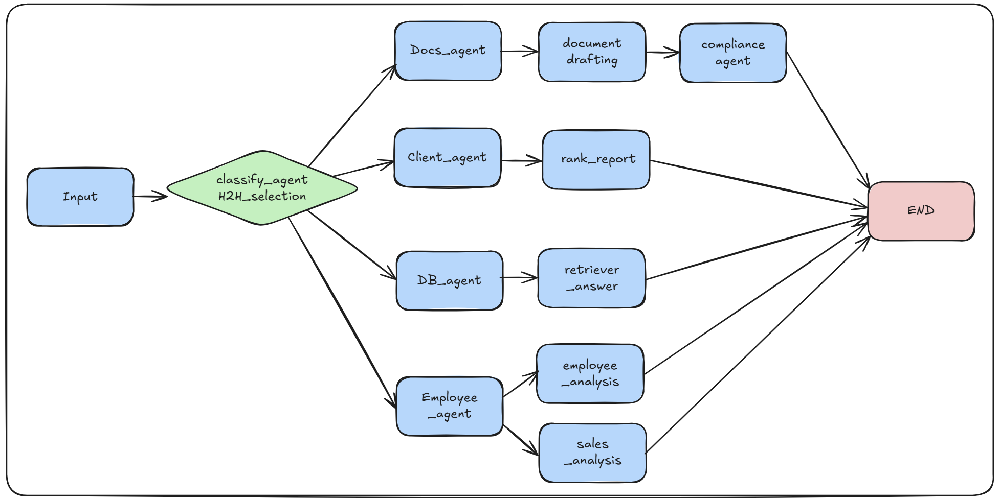
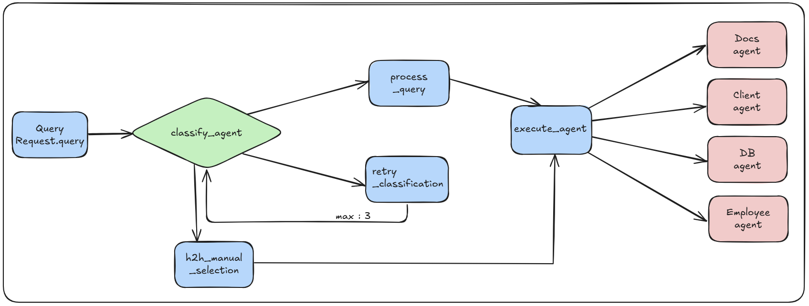
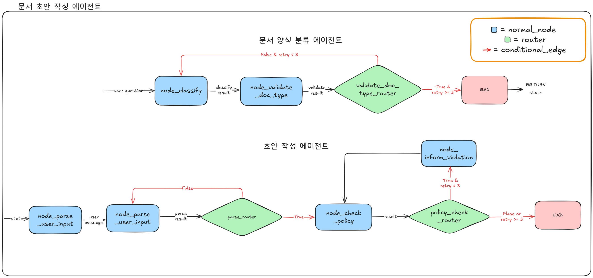
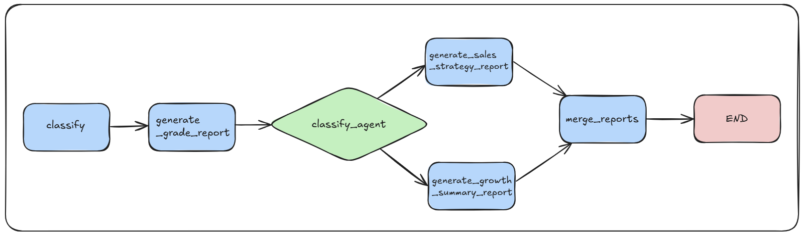
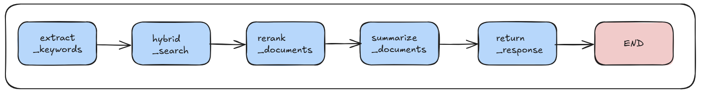
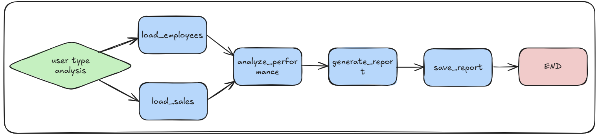

## 제약영업사원 업무효율을 위한 문서검색 및 업무자동화 AI partner - llm기반 QA 챗봇 - Phase 1
### "LLM을 활용한 사내 문서 검색 및 업무지원형 디지털 비서 시스템"
##### 내 생각을 이해하고, 내 일을 함께하는 디지털 분신- 나루톡  
##### 모든 문서와 대화를 하나로 연결하는 스마트 허브 챗봇 - 나투록  
###### 나루톡 ( 모든 기능의 허브라는 뜻의 순우리말 '나룻터' 와 대화를 주고받는 talk의 합성어로,사용자의 모든 생각과 행동을 연결해주는 디지털 분신 챗봇 )

---

## 👥 팀 소개

<table>
  <tr>
    <td align="center">
       
      <b>김도윤</b>  P M 
    </td>
    <td align="center">
       
      <b>손현성</b> 백앤드/인프라 
    </td>
    <td align="center">
       
      <b>이용규</b> QC 
    </td>
    <td align="center">
       
      <b>최문영</b> 프론트 
    </td>
    <td align="center">
       
      <b>허한결</b> 데이터베이스구축 
    </td>
  </tr>
</table>

## 🤖 지원 에이전트 
 
1. **employee_agent**: 직원 실적 분석, 인사 정보, 조직도 관련 업무 
2. **client_agent**: 거래처 분석, 고객 데이터 분석, 매출 분석 
3. **db_agent**: 데이터베이스 검색, 문서 검색, 정보 조회 
4. **docs_agent**: 문서 자동생성, 규정 위반 여부 분석, 컴플라이언스 검토 
  
  

</table>
에이전트 흐름도         

## 📂 **프로젝트 구조** 
