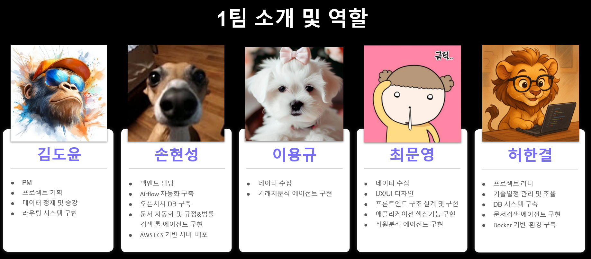

## 제약영업사원 업무효율을 위한 문서검색 및 업무자동화 AI partner - llm기반 QA 챗봇 - Phase 1
### "LLM을 활용한 사내 문서 검색 및 업무지원형 디지털 비서 시스템"
##### 내 생각을 이해하고, 내 일을 함께하는 디지털 분신- 나루톡 <br/>
##### 모든 문서와 대화를 하나로 연결하는 스마트 허브 챗봇 - 나투록 <br/>
###### 나루톡 ( 모든 기능의 허브라는 뜻의 순우리말 '나룻터' 와 대화를 주고받는 talk의 합성어로,사용자의 모든 생각과 행동을 연결해주는 디지털 분신 챗봇 )

---

</div>


## 👥 팀 소개

<table>
<tr>
 </div>
</table>    

</td>
</tr>

  
</table>
  </p>
</div>
<h1>📚 STACKS</h1>

<!-- Backend & Language -->


<!-- Database & Search -->


<!-- AI & LLM -->


<!-- DevOps & Deploy -->

[](https://aws.amazon.com/ec2/)
[](https://www.docker.com/)

<!-- Crawling & OAuth -->


<!-- Collaboration -->


</div>


## 📂 **프로젝트 구조**<br/>
```
Final_Git/
├── backend/                    # 백엔드 서버
│   ├── app/
│   │   ├── api/               # API 엔드포인트
│   │   ├── core/              # 핵심 설정
│   │   └── services/          # 에이전트
│   │       ├── router_agent/  # 라우터
│   │       ├── docs_agent/    # 문서 자동생성 및 규정위반체크 에이전트
│   │       ├── client_agent/  # 거래처 분석 에이전트
│   │       ├── employee_agent/# 직원 실적분석 에이전트
│   │       ├── search_agent/  # 정보검색 에이전트
│   │       ├── common/        # 공통 모듈
│   │       └── tools/         # 유틸리티 도구
│   ├── alembic/               # 데이터베이스 마이그레이션
│   └── Dockerfile
│
├── frontend/                   # 프론트엔드 클라이언트
│   ├── public/
│   ├── src/
│   │   ├── components/        # React 컴포넌트
│   │   ├── services/          # API 서비스
│   │   └── utils/             # 유틸리티 함수
│   └── Dockerfile
│  
├── database/                   # 데이터베이스 설정
│   ├── docker/                # Docker 구성
│   ├── docs/                  # API 문서
│   └── util_scripts/          # 유틸리티 스크립트
└── docker-compose.yml         # Docker Compose 설정
```
## 시스템 아키텍처


### 멀티 에이전트 시스템
- **Router Agent**: 사용자 요청을 분석하여 적절한 에이전트로 라우팅
- **Docs Agent**: 문서 템플릿 기반 자동 생성 및 규정 검토
- **Client Agent**: 거래처 데이터 분석 및 보고서 생성
- **Employee Agent**: 직원 성과 데이터 조회 및 분석
- **Search Agent**: 하이브리드 검색 (키워드 + 벡터)

### API 구조
- **Agent Server (8000)**: 에이전트 API 제공
  - `/api/router/chat`: 메인 챗봇 엔드포인트
  - `/api/docs/*`: 문서 생성 API
  - `/api/client/*`: 거래처 분석 API
  - `/api/employee/*`: 직원 관리 API

- **Database API (8010)**: 데이터베이스 및 인프라 API
  - 사용자 인증/권한 관리
  - 문서 저장 및 검색
  - 대화 히스토리 관리

## 설치 및 실행

### 사전 요구사항
- Docker & Docker Compose
- Node.js 18+ (개발 모드)
- Python 3.11+ (개발 모드)

### 환경 변수 설정
`.env` 파일 생성:
```bash
# OpenAI
OPENAI_API_KEY=your_api_key

# Database
POSTGRES_USER=postgres
POSTGRES_PASSWORD=your_password
POSTGRES_DB=narutalk
POSTGRES_HOST=postgres
POSTGRES_PORT=5432

# MinIO
MINIO_ROOT_USER=minioadmin
MINIO_ROOT_PASSWORD=minioadmin
MINIO_ENDPOINT=minio:9000
MINIO_BUCKET_NAME=narutalk

# OpenSearch
OPENSEARCH_HOST=opensearch-node1
OPENSEARCH_PORT=9200
OPENSEARCH_INITIAL_ADMIN_PASSWORD=your_password

# JWT
JWT_SECRET_KEY=your_secret_key

# PgAdmin
PGADMIN_EMAIL=admin@example.com
PGADMIN_PASSWORD=admin
```

### Docker Compose 실행
```bash
# 데이터베이스 서비스 실행
cd database/docker
docker-compose up -d

# 메인 애플리케이션 실행
cd ../..
docker-compose up -d
```

### 접속 URL
- Frontend: http://localhost:3000
- Agent API: http://localhost:8000/docs
- Database API: http://localhost:8010/docs
- PgAdmin: http://localhost:5050
- MinIO Console: http://localhost:9001
- OpenSearch Dashboard: http://localhost:5601

## 개발 가이드

### 백엔드 개발
```bash
cd backend
pip install -r requirements.txt
python app/agent_server.py
```

### 프론트엔드 개발
```bash
cd frontend
npm install
npm start
```

### 테스트 실행
```bash
# Backend 테스트
cd backend
pytest

# Frontend 테스트
cd frontend
npm test
```

