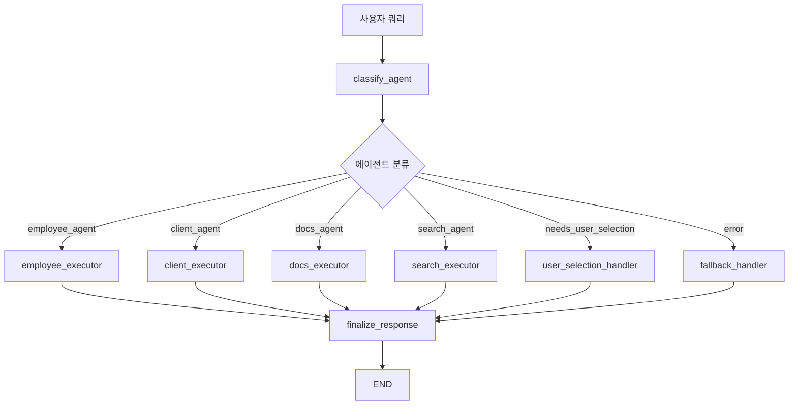

# 🚀 NaruTalk AI 통합 에이전트 시스템 가이드

## 📋 개요

기존의 FastAPI 기반 다중 API 호출 구조를 **LangGraph 기반의 단일 그래프 흐름**으로 통합한 고도화된 시스템입니다.

### 🔄 변경 사항 요약

**이전 구조**:
```
사용자 쿼리 → FastAPI Router → LLM 분류 → 개별 API 호출 → 응답
```

**새로운 구조**:
```
사용자 쿼리 → FastAPI Router → 통합 LangGraph → 에이전트 노드 직접 실행 → 응답
```

## 🏗️ 시스템 아키텍처

### 핵심 구성 요소

1. **`unified_agent_graph.py`** - 통합 LangGraph 워크플로우
2. **`router_api.py`** - 단일 FastAPI 엔드포인트 
3. **기존 에이전트들** - 노드로 wrapping되어 직접 실행

### LangGraph 노드 구조



## 📊 State 구조

```python
class UnifiedState(TypedDict):
    query: str                          # 사용자 쿼리
    session_id: str                     # 세션 ID
    agent: Optional[str]                # 선택된 에이전트
    stage: str                          # 현재 단계
    response: Optional[str]             # 최종 응답
    memory: List[Dict[str, Any]]        # 숏텀 메모리
    error: Optional[str]                # 오류 메시지
    classification_result: Optional[Dict] # 분류 결과
    agent_result: Optional[Dict]        # 에이전트 실행 결과
    available_agents: Optional[List]    # 사용 가능한 에이전트
    requires_followup: Optional[bool]   # 후속 입력 필요 여부
    user_selection_needed: Optional[bool] # 사용자 선택 필요 여부
```

## 🎯 에이전트별 처리 로직

### 1. **Employee Agent** (직원 실적 분석)
- **함수**: `analyze_employee_query()`
- **기능**: LangGraph 기반 4단계 워크플로우 (분석→로딩→계산→보고서)
- **특징**: 이미 LangGraph로 구현되어 있어 그대로 활용

### 2. **Client Agent** (고객 분석)
- **함수**: `analyze_client_query()`
- **기능**: GPT-4o 기반 파라미터 추출 및 더미 분석
- **주의**: Pydantic 모델 반환을 딕셔너리로 변환 처리

### 3. **Docs Agent** (문서 생성)
- **함수**: `interactive_handler.process_initial_request()`
- **기능**: 상호작용 기반 문서 분류 및 생성
- **특징**: 후속 입력이 필요한 경우 `requires_followup=True` 설정

### 4. **Search Agent** (내부 검색)
- **함수**: 더미 구현
- **기능**: 기본적인 검색 응답 제공
- **확장**: 실제 벡터DB/검색 엔진 연동 가능

## 🌐 API 엔드포인트

### 메인 엔드포인트
- `POST /api/router/router` - **통합 그래프 쿼리 처리**

### 관리 엔드포인트
- `POST /api/router/select-agent` - 사용자 직접 에이전트 선택
- `POST /api/router/new-chat` - 새 채팅 시작
- `POST /api/router/reset-agent` - 에이전트 초기화
- `GET /api/router/current-agent/{session_id}` - 현재 에이전트 확인

### 시스템 정보
- `GET /api/router/system-info` - 시스템 정보 조회
- `GET /api/router/agents` - 사용 가능한 에이전트 목록

## 🚀 사용 방법

### 1. 서버 실행
```bash
python run_server.py
```

### 2. API 호출 예시

**기본 쿼리**:
```bash
curl -X POST "http://localhost:8000/api/router/router" \
  -H "Content-Type: application/json" \
  -d '{
    "session_id": "test_session_123",
    "query": "최수아 직원 실적 분석해줘"
  }'
```

**응답 예시**:
```json
{
  "success": true,
  "response": "📊 **직원 실적 분석 완료!**\n\n👤 분석 대상: 최수아\n📅 분석 기간: 202312~202403\n...",
  "agent": "employee_agent",
  "stage": "completed",
  "session_id": "test_session_123",
  "unified_graph": true
}
```

### 3. 테스트 실행
```bash
python test_unified_graph.py
```

## 🔧 핵심 기능

### 1. **지능형 라우팅**
- GPT-4o 기반 자동 에이전트 분류
- 분류 실패 시 사용자 선택 모드 자동 전환
- 세션별 에이전트 고정 (기존 기능 유지)

### 2. **상태 기반 대화 관리**
- LangGraph State를 통한 일관된 상태 관리
- 메모리 기반 대화 컨텍스트 유지
- 단계별 처리 상태 추적

### 3. **오류 처리 및 폴백**
- 각 노드별 예외 처리
- 폴백 핸들러를 통한 graceful degradation
- 상세한 오류 로깅 및 사용자 안내

### 4. **후속 처리 지원**
- 문서 작성 등 다단계 처리 지원
- `requires_followup` 플래그를 통한 추가 입력 요청
- 상호작용 기반 워크플로우

## 🎛️ 설정 및 환경변수

### 필수 환경변수
```bash
OPENAI_API_KEY=your_openai_api_key_here
```

### 선택적 환경변수
```bash
LOG_LEVEL=INFO
DATABASE_URL=sqlite:///database/history/memory.sqlite
```

## 🧪 테스트 케이스

```python
test_cases = [
    {
        "query": "최수아 직원 실적 분석해줘",
        "expected_agent": "employee_agent"
    },
    {
        "query": "서울의료센터 고객 분석해줘",
        "expected_agent": "client_agent"
    },
    {
        "query": "영업방문 결과보고서 작성해줘",
        "expected_agent": "docs_agent"
    },
    {
        "query": "회사 규정 검색해줘",
        "expected_agent": "search_agent"
    },
    {
        "query": "안녕하세요",
        "expected_agent": "needs_user_selection"
    }
]
```

## 🔮 확장 가능성

### 1. **새로운 에이전트 추가**
1. `unified_agent_graph.py`에 새 executor 메서드 추가
2. 라우팅 조건에 새 에이전트 추가
3. 메타데이터에 에이전트 정보 추가

### 2. **실시간 스트리밍**
- LangGraph의 스트리밍 기능 활용
- WebSocket 연동 가능

### 3. **고급 메모리 관리**
- 벡터DB 기반 장기 메모리
- 사용자별 개인화 메모리

### 4. **멀티모달 지원**
- 이미지, 음성 입력 처리
- 파일 업로드 및 분석

## ⚠️ 주의사항

### 1. **임포트 경로**
- 상대 임포트 사용: `from .services.unified_agent_graph import unified_graph`
- 모든 에이전트가 올바른 인터페이스 구현 필요

### 2. **데이터 형식**
- Pydantic 모델을 딕셔너리로 변환 필요
- numpy 타입을 Python 기본 타입으로 변환

### 3. **비동기 처리**
- 모든 에이전트 executor는 `async` 함수
- 적절한 예외 처리 및 타임아웃 설정

### 4. **메모리 관리**
- 대화가 길어질 경우 메모리 크기 제한 고려
- 정기적인 메모리 정리 메커니즘 필요

## 📈 성능 고려사항

### 1. **응답 속도**
- 에이전트 병렬 처리 불가 (순차 실행)
- 각 에이전트의 개별 최적화 필요

### 2. **리소스 사용**
- LangGraph State 메모리 사용량 모니터링
- OpenAI API 호출 수 최적화

### 3. **확장성**
- 단일 그래프 인스턴스 vs 다중 인스턴스
- 세션별 격리 및 병렬 처리 고려

---

## 🎉 마이그레이션 완료!

✅ **FastAPI 다중 API 호출** → **LangGraph 통합 그래프**  
✅ **개별 API 엔드포인트** → **단일 라우터 엔드포인트**  
✅ **HTTP 기반 에이전트 호출** → **직접 함수 호출**  
✅ **분산된 상태 관리** → **통합 State 관리**  
✅ **복잡한 라우팅 로직** → **명확한 노드 기반 흐름**  

### 주요 장점
- **성능 향상**: HTTP 오버헤드 제거
- **유지보수성**: 단일 그래프로 흐름 통합  
- **확장성**: 새로운 노드 추가 용이
- **안정성**: 체계적인 오류 처리
- **가시성**: 명확한 처리 단계 추적

**🎯 목표 달성**: LangGraph 기반 통합 에이전트 시스템 구축 완료! 