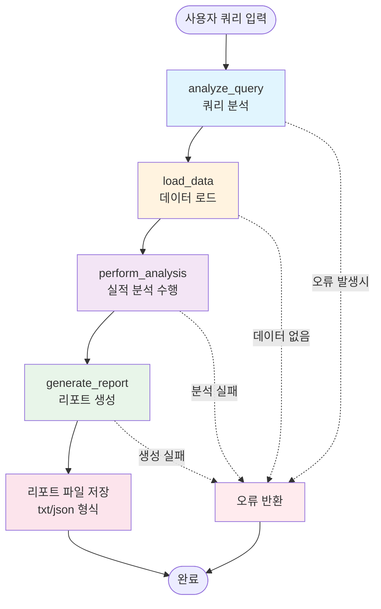
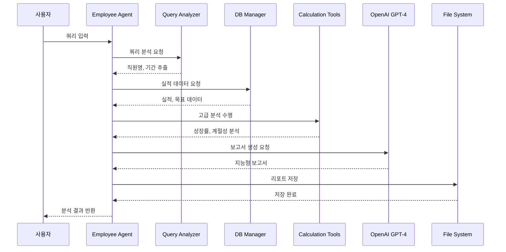

# 직원 실적 분석 에이전트 워크플로우

## 현재 구현된 워크플로우 (코드 기반)

## 각 노드별 상세 기능

### 1. analyze_query (쿼리 분석)
- **입력**: 사용자의 자연어 쿼리
- **처리**: 
  - EmployeeQueryAnalyzer를 통한 쿼리 분석
  - 직원명, 기간, 분석 유형 추출
  - 참조 해결 (멀티턴 대화 지원)
- **출력**: 구조화된 쿼리 분석 결과

### 2. load_data (데이터 로드)
- **입력**: 쿼리 분석 결과
- **처리**:
  - EmployeeDBManager를 통한 DB 접근
  - 실적 데이터 조회 (performance_summary)
  - 목표 대비 실적 조회 (target_vs_performance)
  - 성장률 분석 데이터 조회
- **출력**: 실적 및 목표 데이터

### 3. perform_analysis (실적 분석)
- **입력**: 로드된 데이터
- **처리**:
  - PerformanceCalculationTools를 통한 고급 분석
  - 성장률 분석 (안정성 포함)
  - 계절성 분석
  - 달성률 분석
  - 종합 평가 점수 계산 (S/A/B/C/D 등급)
- **출력**: 분석 결과 딕셔너리

### 4. generate_report (리포트 생성)
- **입력**: 분석 결과
- **처리**:
  - LLM(GPT-4)을 활용한 지능형 보고서 생성
  - 폴백: 기본 템플릿 기반 보고서
  - 파일 저장 (_save_report_to_file 호출)
- **출력**: 
  - 텍스트 형식의 보고서
  - 파일 저장 (txt, json)

## 데이터 흐름

## 주요 특징

1. **선형 워크플로우**: 각 단계가 순차적으로 진행
2. **오류 처리**: 각 노드에서 오류 발생 시 state["error"]에 저장
3. **LLM 통합**: 보고서 생성 시 GPT-4 활용
4. **파일 저장**: 분석 결과를 txt와 json 형식으로 자동 저장
5. **멀티턴 대화**: 이전 대화 컨텍스트 참조 가능

## 저장 경로
- **텍스트 리포트**: `backend/app/output/employee_reports/직원실적분석_{직원명}_{기간}_{timestamp}.txt`
- **JSON 데이터**: `backend/app/output/employee_reports/직원실적분석_{직원명}_{기간}_{timestamp}.json`