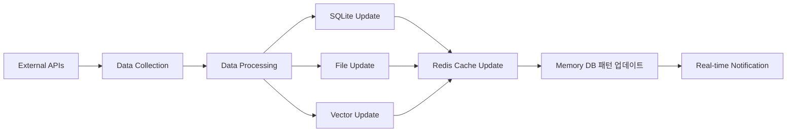

# 🏛️ 시스템설계서 (System Design Document)

## 📋 문서 개요

### 1.1 목적
의료업계 영업/관리용 QA 챗봇 시스템의 Phase 1 아키텍처 설계 및 시스템 구조 정의

### 1.2 범위
- 전체 시스템 아키텍처
- 컴포넌트 설계 및 상호 관계
- 데이터 플로우 설계
- 기술 스택 및 인프라 설계

### 1.3 시스템 개요
**Phase 1 특징**: SQLite + File System + FAISS + Redis 기반 분산 아키텍처

## 🏗️ 전체 시스템 아키텍처

### 2.1 아키텍처 패턴
```
┌─────────────────────────────────────────────────────────────┐
│                     User Interface Layer                    │
├─────────────────────────────────────────────────────────────┤
│                    API Gateway Layer                        │
├─────────────────────────────────────────────────────────────┤
│                  Business Logic Layer                       │
├─────────────────────────────────────────────────────────────┤
│                 Data Access Layer                           │
├─────────────────────────────────────────────────────────────┤
│                  Data Storage Layer                         │
└─────────────────────────────────────────────────────────────┘
```

### 2.2 시스템 컴포넌트 구성
```
Frontend (React)
    ↓
Django API Gateway
    ↓
7개 FastAPI 마이크로서비스
    ↓
LangGraph Workflows
    ↓
Data Layer (SQLite + Files + FAISS + Redis)
```

### 2.3 마이크로서비스 아키텍처
```yaml
services:
  - name: "Django Gateway"
    port: 8000
    responsibility: "API 라우팅, 인증, 요청 분배"
  
  - name: "Integrated Search"
    port: 8001
    responsibility: "통합 검색, 하이브리드 검색"
  
  - name: "Performance Analytics"
    port: 8002
    responsibility: "실적 분석, 보고서 생성"
  
  - name: "Client Analysis"
    port: 8003
    responsibility: "거래처 분석, 등급 분류"
  
  - name: "Document Automation"
    port: 8004
    responsibility: "문서 생성, 규정 검토"
  
  - name: "Conversation Analysis"
    port: 8005
    responsibility: "대화 분석, 감정 분석"
  
  - name: "Data Wiki"
    port: 8006
    responsibility: "지식 관리, 위키 시스템"
  
  - name: "News Recommendation"
    port: 8007
    responsibility: "뉴스 추천, 일일 보고서"
  
  - name: "ML Performance Prediction"
    port: 8008
    responsibility: "실적 예측, 성과 분석"
  
  - name: "Memory Management"
    port: 8009
    responsibility: "메모리 관리, 컨텍스트 저장/조회"
```

### 2.4 통합 AI 시스템 아키텍처
```yaml
AI_System:
  Primary_LLM: "OpenAI GPT-3.5/4"
  Deployment: "전체 파이프라인 통합"
  
  Pipeline_Flow:
    1. Intent_Classification: "OpenAI GPT → 사용자 의도 분류"
    2. Data_Processing: "각 서비스별 데이터 처리"
    3. LangGraph_Workflow: "상태 관리 및 워크플로우 제어"
    4. Memory_Integration: "숏텀/롱텀 메모리 조회"
    5. Result_Fusion: "OpenAI GPT → 결과 통합"
    6. Final_Generation: "OpenAI GPT-4 → 최종 답변 생성"
```

### 2.5 메모리 시스템 아키텍처
```yaml
Memory_System:
  Short_Term_Memory:
    Technology: "Redis"
    Port: 6379
    Scope: "현재 세션 범위"
    Data_Types:
      - conversation_context: "대화 컨텍스트"
      - session_state: "세션 상태"
      - temp_calculations: "임시 계산 결과"
      - user_preferences: "일시적 사용자 선호도"
    TTL: "30분 (자동 만료)"
  
  Long_Term_Memory:
    Technology: "SQLite Memory DB"
    Database: "memory.db"
    Scope: "영구적 사용자 기억"
    Data_Types:
      - conversation_history: "대화 히스토리"
      - user_profile: "사용자 프로필"
      - learned_patterns: "학습된 패턴"
      - personalization_data: "개인화 데이터"
    Retention: "무제한 (정책에 따라 관리)"
```

## 🔄 데이터 플로우 설계

### 3.1 통합 QA 플로우 (OpenAI + 메모리 시스템)


### 3.2 메모리 시스템 플로우


### 3.3 ML 예측 플로우


### 3.4 실시간 데이터 플로우


## 🏢 시스템 컴포넌트 설계

### 4.1 프론트엔드 컴포넌트
```typescript
// 주요 컴포넌트 구조
src/
├── components/
│   ├── common/         // 공통 컴포넌트
│   ├── search/         // 검색 관련
│   ├── dashboard/      // 대시보드
│   ├── chat/           // 채팅 인터페이스
│   └── reports/        // 보고서 뷰어
├── pages/              // 페이지 컴포넌트
├── services/           // API 서비스
├── utils/              // 유틸리티
└── styles/             // 스타일링
```

### 4.2 백엔드 서비스 설계
```python
# Django Gateway 구조
apps/
├── authentication/     # 사용자 인증
├── gateway/           # API 라우팅
├── monitoring/        # 모니터링
└── middleware/        # 미들웨어

# FastAPI 서비스 공통 구조
service/
├── api/              # API 엔드포인트
├── services/         # 비즈니스 로직
├── models/           # 데이터 모델
├── dependencies/     # 의존성
└── utils/            # 유틸리티
```

### 4.3 데이터 레이어 설계
```yaml
# SQLite 구조
databases:
  - main.db:          # 메인 애플리케이션
  - users.db:         # 사용자 관리
  - sales.db:         # 실적 데이터
  - clients.db:       # 거래처 데이터
  - news.db:          # 뉴스 데이터
  - cache.db:         # 캐시 데이터
  - ml.db:            # ML 모델 관리
  - memory.db:        # 메모리 시스템

# 메모리 시스템 구조
memory_system:
  Redis:
    port: 6379
    databases:
      - db0: session_management      # 세션 관리
      - db1: conversation_context    # 대화 컨텍스트
      - db2: temp_calculations       # 임시 계산
      - db3: user_preferences        # 사용자 선호도
  
  Memory_DB:
    database: memory.db
    tables:
      - conversation_history: "대화 히스토리"
      - user_profiles: "사용자 프로필"
      - learned_patterns: "학습된 패턴"
      - personalization_data: "개인화 데이터"
      - memory_metadata: "메모리 메타데이터"

# 파일 시스템 구조
files/
├── documents/        # 문서 저장
├── uploads/          # 업로드 파일
├── conversations/    # 대화 파일
├── wiki/            # 위키 데이터
└── memory/          # 메모리 백업

# FAISS 벡터 구조
vectors/
├── indices/          # 벡터 인덱스
├── embeddings/       # 임베딩 파일
└── metadata/         # 메타데이터

# MLflow 구조
mlflow/
├── models/           # 모델 저장소
├── experiments/      # 실험 관리
├── artifacts/        # 아티팩트
└── metadata/         # 메타데이터
```

## 🛠️ 기술 스택 설계

### 5.1 개발 기술 스택
```yaml
Frontend:
  Framework: React 18
  Language: TypeScript
  State Management: Redux Toolkit
  UI Library: Material-UI
  Build Tool: Vite
  Testing: Jest, React Testing Library

Backend:
  API Gateway: Django 4.2
  Microservices: FastAPI
  Language: Python 3.11
  AI Framework: LangGraph
  Task Queue: Celery
  Testing: pytest

AI/ML:
  LLM: OpenAI GPT-3.5/4 (전체 파이프라인 통합)
  Embedding: KURE-v1
  Reranker: BGE-Reranker-ko
  Vector DB: FAISS
  ML Libraries: scikit-learn, pandas, numpy
  ML Platform: MLflow
  Workflow: LangGraph (상태 관리)
  Memory System: Redis + SQLite
```

### 5.2 인프라 기술 스택
```yaml
Database:
  Primary: SQLite
  Cache: Redis
  Vector: FAISS
  Files: Local File System
  Memory: Redis + SQLite (memory.db)
  ML_Storage: MLflow

Container:
  Engine: Docker
  Orchestration: Docker Compose
  Registry: Docker Hub

Memory_Management:
  Short_Term: Redis (TTL 30분)
  Long_Term: SQLite (memory.db)
  Backup: File System
  Sync: Real-time bidirectional

Monitoring:
  Metrics: Prometheus
  Visualization: Grafana
  Logging: ELK Stack
  Health Check: Custom Health Endpoints
  Memory_Monitoring: Redis Monitor + Custom Metrics

Development:
  Version Control: Git
  CI/CD: GitHub Actions
  Code Quality: Black, Flake8, mypy
  Documentation: Sphinx
```

## 🔧 상세 컴포넌트 설계

### 6.1 Django API Gateway
```python
# settings.py 주요 설정
INSTALLED_APPS = [
    'django.contrib.admin',
    'django.contrib.auth',
    'rest_framework',
    'corsheaders',
    'apps.authentication',
    'apps.gateway',
    'apps.monitoring',
]

MIDDLEWARE = [
    'corsheaders.middleware.CorsMiddleware',
    'middleware.auth_middleware.AuthMiddleware',
    'middleware.logging_middleware.LoggingMiddleware',
]

# 라우팅 설계
urlpatterns = [
    path('api/auth/', include('apps.authentication.urls')),
    path('api/search/', GatewayView.as_view(), {'service': 'search'}),
    path('api/analytics/', GatewayView.as_view(), {'service': 'analytics'}),
    path('api/clients/', GatewayView.as_view(), {'service': 'clients'}),
    path('api/documents/', GatewayView.as_view(), {'service': 'documents'}),
    path('api/conversations/', GatewayView.as_view(), {'service': 'conversations'}),
    path('api/wiki/', GatewayView.as_view(), {'service': 'wiki'}),
    path('api/news/', GatewayView.as_view(), {'service': 'news'}),
]
```

### 6.2 FastAPI 마이크로서비스
```python
# 공통 서비스 구조
from fastapi import FastAPI, Depends
from fastapi.middleware.cors import CORSMiddleware

app = FastAPI(title="Service Name", version="1.0.0")

# 미들웨어 설정
app.add_middleware(
    CORSMiddleware,
    allow_origins=["*"],
    allow_credentials=True,
    allow_methods=["*"],
    allow_headers=["*"],
)

# 라우터 등록
app.include_router(router, prefix="/api/v1")

# 의존성 주입
@app.dependency_overrides
def get_database():
    return DatabaseClient()

def get_ai_client():
    return AIModelClient()
```

### 6.3 LangGraph 워크플로우
```python
# StateGraph 설계
from langgraph.graph import StateGraph
from typing import TypedDict, List

class QAState(TypedDict):
    query: str
    intent: str
    search_results: List[dict]
    analysis_results: dict
    final_answer: str

# 워크플로우 노드
def intent_classification_node(state: QAState) -> QAState:
    # 의도 분류 로직
    pass

def search_node(state: QAState) -> QAState:
    # 검색 로직
    pass

def analysis_node(state: QAState) -> QAState:
    # 분석 로직
    pass

def generation_node(state: QAState) -> QAState:
    # 답변 생성 로직
    pass

# 그래프 구성
workflow = StateGraph(QAState)
workflow.add_node("intent", intent_classification_node)
workflow.add_node("search", search_node)
workflow.add_node("analysis", analysis_node)
workflow.add_node("generation", generation_node)
```

## 📊 데이터 모델 설계

### 6.1 사용자 관리 모델
```python
# User 모델
class User(BaseModel):
    id: str
    username: str
    email: str
    role: UserRole
    created_at: datetime
    last_login: datetime
    is_active: bool
    permissions: List[Permission]

class UserRole(str, Enum):
    ADMIN = "admin"
    USER = "user"

class Permission(BaseModel):
    resource: str
    actions: List[str]
```

### 6.2 검색 결과 모델
```python
class SearchResult(BaseModel):
    id: str
    title: str
    content: str
    source: str
    score: float
    metadata: dict
    created_at: datetime

class SearchResponse(BaseModel):
    results: List[SearchResult]
    total_count: int
    search_time: float
    query: str
    filters: dict
```

### 6.3 분석 결과 모델
```python
class AnalysisResult(BaseModel):
    analysis_id: str
    type: str
    data: dict
    insights: List[str]
    charts: List[Chart]
    created_at: datetime

class Chart(BaseModel):
    type: str
    data: dict
    options: dict
```

## 🔐 보안 설계

### 7.1 인증 및 권한 관리
```python
# JWT 토큰 기반 인증
from datetime import datetime, timedelta
from jose import JWTError, jwt

class AuthService:
    SECRET_KEY = "your-secret-key"
    ALGORITHM = "HS256"
    ACCESS_TOKEN_EXPIRE_MINUTES = 30
    
    def create_access_token(self, data: dict):
        to_encode = data.copy()
        expire = datetime.utcnow() + timedelta(minutes=self.ACCESS_TOKEN_EXPIRE_MINUTES)
        to_encode.update({"exp": expire})
        return jwt.encode(to_encode, self.SECRET_KEY, algorithm=self.ALGORITHM)
    
    def verify_token(self, token: str):
        try:
            payload = jwt.decode(token, self.SECRET_KEY, algorithms=[self.ALGORITHM])
            return payload
        except JWTError:
            return None
```

### 7.2 데이터 암호화
```python
# 민감 데이터 암호화
from cryptography.fernet import Fernet

class EncryptionService:
    def __init__(self, key: bytes):
        self.cipher = Fernet(key)
    
    def encrypt(self, data: str) -> str:
        return self.cipher.encrypt(data.encode()).decode()
    
    def decrypt(self, encrypted_data: str) -> str:
        return self.cipher.decrypt(encrypted_data.encode()).decode()
```

### 7.3 API 보안
```python
# API 보안 미들웨어
from fastapi import Request, HTTPException
from fastapi.security import HTTPBearer, HTTPAuthorizationCredentials

class SecurityMiddleware:
    def __init__(self):
        self.bearer_scheme = HTTPBearer()
    
    async def verify_token(self, credentials: HTTPAuthorizationCredentials):
        if not credentials or not credentials.credentials:
            raise HTTPException(status_code=401, detail="Missing token")
        
        # 토큰 검증 로직
        return self.auth_service.verify_token(credentials.credentials)
```

## 🚀 성능 최적화 설계

### 8.1 캐싱 전략
```python
# Redis 캐싱
class CacheService:
    def __init__(self, redis_client):
        self.redis = redis_client
        self.default_ttl = 3600  # 1시간
    
    async def get(self, key: str):
        return await self.redis.get(key)
    
    async def set(self, key: str, value: str, ttl: int = None):
        ttl = ttl or self.default_ttl
        await self.redis.setex(key, ttl, value)
    
    async def delete(self, key: str):
        await self.redis.delete(key)
```

### 8.2 데이터베이스 최적화
```python
# SQLite 최적화
class DatabaseOptimizer:
    def __init__(self, db_path: str):
        self.db_path = db_path
    
    def optimize_sqlite(self):
        # 인덱스 생성
        self.create_indexes()
        # VACUUM 실행
        self.vacuum_database()
        # 통계 업데이트
        self.update_statistics()
    
    def create_indexes(self):
        indexes = [
            "CREATE INDEX IF NOT EXISTS idx_users_email ON users(email)",
            "CREATE INDEX IF NOT EXISTS idx_sales_date ON sales(date)",
            "CREATE INDEX IF NOT EXISTS idx_clients_grade ON clients(grade)",
        ]
        for index in indexes:
            self.execute_sql(index)
```

### 8.3 비동기 처리
```python
# 비동기 작업 처리
from celery import Celery
from celery.result import AsyncResult

app = Celery('qa_chatbot')

@app.task
def generate_report_async(report_params: dict):
    # 보고서 생성 로직
    return report_generator.generate(report_params)

@app.task
def process_large_file_async(file_path: str):
    # 대용량 파일 처리 로직
    return file_processor.process(file_path)
```

## 📋 시스템 제약사항

### 9.1 성능 제약사항
- **동시 사용자**: 최대 20명
- **응답 시간**: 3초 이내 (일반), 30초 이내 (분석)
- **파일 크기**: 최대 100MB
- **메모리 사용량**: 시스템당 최대 8GB

### 9.2 기술적 제약사항
- **OpenAI API 호출**: 분당 100회 제한
- **FAISS 벡터**: 최대 100만 벡터
- **SQLite 파일**: 각 DB 최대 1GB
- **Redis 메모리**: 최대 2GB

## 🎯 확장성 고려사항

### 10.1 수평 확장
```yaml
# 향후 확장 계획
Phase 2:
  - OpenSearch 통합
  - 클러스터링 지원
  - 로드 밸런싱

Phase 3:
  - 클라우드 네이티브
  - 오토 스케일링
  - 멀티 리전 지원
```

### 10.2 모니터링 설계
```python
# 시스템 모니터링
class SystemMonitor:
    def __init__(self):
        self.metrics = PrometheusMetrics()
    
    def track_request(self, service: str, endpoint: str, duration: float):
        self.metrics.request_duration.labels(
            service=service,
            endpoint=endpoint
        ).observe(duration)
    
    def track_error(self, service: str, error_type: str):
        self.metrics.error_count.labels(
            service=service,
            error_type=error_type
        ).inc()
```

## 📝 설계 검토 체크리스트

- [ ] 아키텍처 패턴 적절성 검토
- [ ] 컴포넌트 간 결합도 최소화
- [ ] 확장성 및 유지보수성 확보
- [ ] 보안 요구사항 충족
- [ ] 성능 요구사항 충족
- [ ] 데이터 일관성 보장
- [ ] 오류 처리 및 복구 방안 수립
- [ ] 모니터링 및 로깅 체계 구축

**문서 버전**: 2.0
**최종 수정일**: 2024-01-15
**검토자**: 시스템 아키텍트
**승인자**: 기술 리더 