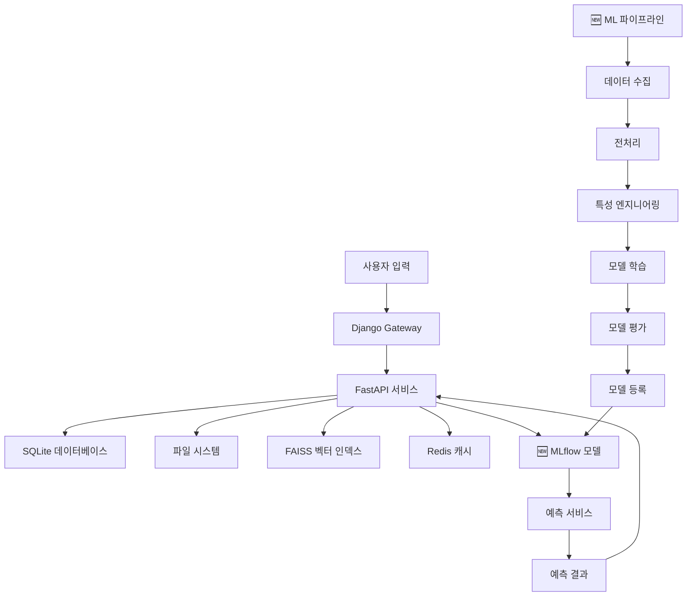
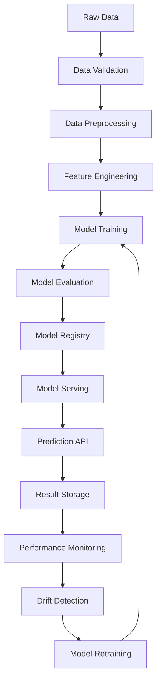

# 🗄️ 데이터베이스 설계서 (Database Design)

## 📋 문서 정보
- **프로젝트명**: 의료업계 영업/관리용 QA 챗봇 시스템
- **문서 버전**: 2.0
- **작성일**: 2024-01-01
- **최종 수정일**: 2024-01-15
- **검토자**: 데이터베이스 설계자
- **승인자**: 시스템 아키텍트

## 🎯 데이터베이스 개요

### 설계 목표
- **성능**: 고속 검색 및 분석 처리
- **확장성**: 데이터 증가에 따른 유연한 확장
- **🆕 ML 지원**: 머신러닝 모델 및 학습 데이터 관리
- **무결성**: 데이터 정합성 보장
- **보안**: 민감한 데이터 보호

### 데이터베이스 구성
- **SQLite**: 7개 분리된 데이터베이스 (기존 6개 + 🆕 ML 1개)
- **File System**: 구조화된 파일 저장소
- **FAISS**: 벡터 인덱스 저장소
- **Redis**: 캐시 및 세션 저장소
- **🆕 MLflow**: 모델 및 실험 관리

## 📊 SQLite 데이터베이스 설계

### 1. main.db - 메인 애플리케이션 데이터베이스

#### 시스템 설정 테이블
```sql
-- 시스템 설정
CREATE TABLE system_settings (
    id INTEGER PRIMARY KEY AUTOINCREMENT,
    key TEXT NOT NULL UNIQUE,
    value TEXT,
    description TEXT,
    created_at TIMESTAMP DEFAULT CURRENT_TIMESTAMP,
    updated_at TIMESTAMP DEFAULT CURRENT_TIMESTAMP
);

-- 메타데이터 테이블
CREATE TABLE metadata (
    id INTEGER PRIMARY KEY AUTOINCREMENT,
    table_name TEXT NOT NULL,
    record_count INTEGER DEFAULT 0,
    last_updated TIMESTAMP DEFAULT CURRENT_TIMESTAMP,
    schema_version TEXT DEFAULT '1.0'
);
```

#### 인덱스 설정
```sql
CREATE INDEX idx_system_settings_key ON system_settings(key);
CREATE INDEX idx_metadata_table_name ON metadata(table_name);
```

### 2. users.db - 사용자 관리 데이터베이스

#### 사용자 테이블
```sql
-- 사용자 정보
CREATE TABLE users (
    id INTEGER PRIMARY KEY AUTOINCREMENT,
    username TEXT NOT NULL UNIQUE,
    email TEXT NOT NULL UNIQUE,
    password_hash TEXT NOT NULL,
    full_name TEXT,
    department TEXT,
    role TEXT DEFAULT 'user',
    is_active BOOLEAN DEFAULT TRUE,
    created_at TIMESTAMP DEFAULT CURRENT_TIMESTAMP,
    updated_at TIMESTAMP DEFAULT CURRENT_TIMESTAMP
);

-- 사용자 프로필
CREATE TABLE user_profiles (
    id INTEGER PRIMARY KEY AUTOINCREMENT,
    user_id INTEGER NOT NULL,
    phone TEXT,
    avatar_url TEXT,
    preferences TEXT, -- JSON 형태
    timezone TEXT DEFAULT 'Asia/Seoul',
    language TEXT DEFAULT 'ko',
    FOREIGN KEY (user_id) REFERENCES users(id)
);

-- 사용자 세션
CREATE TABLE user_sessions (
    id INTEGER PRIMARY KEY AUTOINCREMENT,
    user_id INTEGER NOT NULL,
    session_token TEXT NOT NULL UNIQUE,
    expires_at TIMESTAMP NOT NULL,
    ip_address TEXT,
    user_agent TEXT,
    created_at TIMESTAMP DEFAULT CURRENT_TIMESTAMP,
    FOREIGN KEY (user_id) REFERENCES users(id)
);
```

#### 인덱스 설정
```sql
CREATE INDEX idx_users_username ON users(username);
CREATE INDEX idx_users_email ON users(email);
CREATE INDEX idx_user_profiles_user_id ON user_profiles(user_id);
CREATE INDEX idx_user_sessions_token ON user_sessions(session_token);
CREATE INDEX idx_user_sessions_expires ON user_sessions(expires_at);
```

### 3. sales.db - 실적 데이터베이스

#### 실적 데이터 테이블
```sql
-- 실적 데이터
CREATE TABLE sales_records (
    id INTEGER PRIMARY KEY AUTOINCREMENT,
    user_id INTEGER NOT NULL,
    client_id INTEGER NOT NULL,
    product_id INTEGER,
    sale_amount DECIMAL(15, 2) NOT NULL,
    sale_date DATE NOT NULL,
    quarter TEXT NOT NULL, -- 'Q1', 'Q2', 'Q3', 'Q4'
    year INTEGER NOT NULL,
    region TEXT,
    category TEXT,
    status TEXT DEFAULT 'completed',
    notes TEXT,
    created_at TIMESTAMP DEFAULT CURRENT_TIMESTAMP,
    updated_at TIMESTAMP DEFAULT CURRENT_TIMESTAMP
);

-- 실적 목표
CREATE TABLE sales_targets (
    id INTEGER PRIMARY KEY AUTOINCREMENT,
    user_id INTEGER NOT NULL,
    target_amount DECIMAL(15, 2) NOT NULL,
    target_period TEXT NOT NULL, -- 'monthly', 'quarterly', 'yearly'
    target_date DATE NOT NULL,
    achieved_amount DECIMAL(15, 2) DEFAULT 0,
    achievement_rate DECIMAL(5, 2) DEFAULT 0,
    created_at TIMESTAMP DEFAULT CURRENT_TIMESTAMP,
    updated_at TIMESTAMP DEFAULT CURRENT_TIMESTAMP
);

-- 🆕 실적 예측 기록
CREATE TABLE sales_predictions (
    id INTEGER PRIMARY KEY AUTOINCREMENT,
    user_id INTEGER NOT NULL,
    client_id INTEGER,
    prediction_type TEXT NOT NULL, -- 'user', 'client', 'product'
    predicted_amount DECIMAL(15, 2) NOT NULL,
    confidence_score DECIMAL(3, 2) NOT NULL,
    prediction_period TEXT NOT NULL, -- 'monthly', 'quarterly', 'yearly'
    prediction_date DATE NOT NULL,
    actual_amount DECIMAL(15, 2),
    accuracy_score DECIMAL(3, 2),
    model_version TEXT,
    created_at TIMESTAMP DEFAULT CURRENT_TIMESTAMP
);

-- 제품 정보
CREATE TABLE products (
    id INTEGER PRIMARY KEY AUTOINCREMENT,
    name TEXT NOT NULL,
    category TEXT,
    price DECIMAL(10, 2),
    description TEXT,
    is_active BOOLEAN DEFAULT TRUE,
    created_at TIMESTAMP DEFAULT CURRENT_TIMESTAMP
);
```

#### 인덱스 설정
```sql
CREATE INDEX idx_sales_records_user_id ON sales_records(user_id);
CREATE INDEX idx_sales_records_client_id ON sales_records(client_id);
CREATE INDEX idx_sales_records_date ON sales_records(sale_date);
CREATE INDEX idx_sales_records_quarter_year ON sales_records(quarter, year);
CREATE INDEX idx_sales_targets_user_id ON sales_targets(user_id);
CREATE INDEX idx_sales_targets_date ON sales_targets(target_date);
CREATE INDEX idx_sales_predictions_user_id ON sales_predictions(user_id);
CREATE INDEX idx_sales_predictions_date ON sales_predictions(prediction_date);
CREATE INDEX idx_sales_predictions_type ON sales_predictions(prediction_type);
```

### 4. clients.db - 거래처 관리 데이터베이스

#### 거래처 테이블
```sql
-- 거래처 정보
CREATE TABLE clients (
    id INTEGER PRIMARY KEY AUTOINCREMENT,
    name TEXT NOT NULL,
    business_number TEXT UNIQUE,
    industry TEXT,
    company_size TEXT,
    address TEXT,
    phone TEXT,
    email TEXT,
    website TEXT,
    established_date DATE,
    credit_rating TEXT,
    annual_revenue DECIMAL(15, 2),
    employee_count INTEGER,
    is_active BOOLEAN DEFAULT TRUE,
    created_at TIMESTAMP DEFAULT CURRENT_TIMESTAMP,
    updated_at TIMESTAMP DEFAULT CURRENT_TIMESTAMP
);

-- 거래처 담당자
CREATE TABLE client_contacts (
    id INTEGER PRIMARY KEY AUTOINCREMENT,
    client_id INTEGER NOT NULL,
    name TEXT NOT NULL,
    position TEXT,
    department TEXT,
    phone TEXT,
    email TEXT,
    is_primary BOOLEAN DEFAULT FALSE,
    created_at TIMESTAMP DEFAULT CURRENT_TIMESTAMP,
    FOREIGN KEY (client_id) REFERENCES clients(id)
);

-- 거래처 분석 데이터
CREATE TABLE client_analysis (
    id INTEGER PRIMARY KEY AUTOINCREMENT,
    client_id INTEGER NOT NULL,
    risk_score DECIMAL(3, 2) NOT NULL,
    grade TEXT NOT NULL, -- 'S', 'A', 'B', 'C'
    profitability_score DECIMAL(3, 2),
    loyalty_score DECIMAL(3, 2),
    growth_potential TEXT,
    analysis_date DATE NOT NULL,
    model_version TEXT,
    created_at TIMESTAMP DEFAULT CURRENT_TIMESTAMP,
    FOREIGN KEY (client_id) REFERENCES clients(id)
);

-- 🆕 거래처 예측 데이터
CREATE TABLE client_predictions (
    id INTEGER PRIMARY KEY AUTOINCREMENT,
    client_id INTEGER NOT NULL,
    predicted_grade TEXT NOT NULL,
    confidence_score DECIMAL(3, 2) NOT NULL,
    churn_probability DECIMAL(3, 2),
    growth_prediction DECIMAL(5, 2),
    recommended_actions TEXT, -- JSON 형태
    prediction_date DATE NOT NULL,
    model_version TEXT,
    created_at TIMESTAMP DEFAULT CURRENT_TIMESTAMP,
    FOREIGN KEY (client_id) REFERENCES clients(id)
);
```

#### 인덱스 설정
```sql
CREATE INDEX idx_clients_name ON clients(name);
CREATE INDEX idx_clients_business_number ON clients(business_number);
CREATE INDEX idx_clients_industry ON clients(industry);
CREATE INDEX idx_client_contacts_client_id ON client_contacts(client_id);
CREATE INDEX idx_client_analysis_client_id ON client_analysis(client_id);
CREATE INDEX idx_client_analysis_date ON client_analysis(analysis_date);
CREATE INDEX idx_client_predictions_client_id ON client_predictions(client_id);
CREATE INDEX idx_client_predictions_date ON client_predictions(prediction_date);
```

### 5. news.db - 뉴스 및 정보 데이터베이스

#### 뉴스 테이블
```sql
-- 뉴스 기사
CREATE TABLE news_articles (
    id INTEGER PRIMARY KEY AUTOINCREMENT,
    title TEXT NOT NULL,
    content TEXT,
    summary TEXT,
    url TEXT UNIQUE,
    source TEXT,
    category TEXT,
    published_date DATE,
    relevance_score DECIMAL(3, 2),
    sentiment_score DECIMAL(3, 2),
    keywords TEXT, -- JSON 형태
    created_at TIMESTAMP DEFAULT CURRENT_TIMESTAMP
);

-- 뉴스 추천 기록
CREATE TABLE news_recommendations (
    id INTEGER PRIMARY KEY AUTOINCREMENT,
    user_id INTEGER NOT NULL,
    article_id INTEGER NOT NULL,
    recommendation_score DECIMAL(3, 2),
    is_clicked BOOLEAN DEFAULT FALSE,
    clicked_at TIMESTAMP,
    created_at TIMESTAMP DEFAULT CURRENT_TIMESTAMP,
    FOREIGN KEY (article_id) REFERENCES news_articles(id)
);
```

#### 인덱스 설정
```sql
CREATE INDEX idx_news_articles_published_date ON news_articles(published_date);
CREATE INDEX idx_news_articles_category ON news_articles(category);
CREATE INDEX idx_news_recommendations_user_id ON news_recommendations(user_id);
CREATE INDEX idx_news_recommendations_article_id ON news_recommendations(article_id);
```

### 6. cache.db - 캐시 데이터베이스

#### 캐시 테이블
```sql
-- 검색 결과 캐시
CREATE TABLE search_cache (
    id INTEGER PRIMARY KEY AUTOINCREMENT,
    query_hash TEXT NOT NULL UNIQUE,
    query_text TEXT NOT NULL,
    results TEXT NOT NULL, -- JSON 형태
    result_count INTEGER,
    execution_time REAL,
    expires_at TIMESTAMP NOT NULL,
    created_at TIMESTAMP DEFAULT CURRENT_TIMESTAMP
);

-- 분석 결과 캐시
CREATE TABLE analysis_cache (
    id INTEGER PRIMARY KEY AUTOINCREMENT,
    cache_key TEXT NOT NULL UNIQUE,
    cache_type TEXT NOT NULL, -- 'report', 'chart', 'prediction'
    data TEXT NOT NULL, -- JSON 형태
    expires_at TIMESTAMP NOT NULL,
    created_at TIMESTAMP DEFAULT CURRENT_TIMESTAMP
);
```

#### 인덱스 설정
```sql
CREATE INDEX idx_search_cache_query_hash ON search_cache(query_hash);
CREATE INDEX idx_search_cache_expires ON search_cache(expires_at);
CREATE INDEX idx_analysis_cache_key ON analysis_cache(cache_key);
CREATE INDEX idx_analysis_cache_type ON analysis_cache(cache_type);
CREATE INDEX idx_analysis_cache_expires ON analysis_cache(expires_at);
```

### 🆕 7. ml.db - 머신러닝 데이터베이스

#### ML 모델 관리 테이블
```sql
-- ML 모델 정보
CREATE TABLE ml_models (
    id INTEGER PRIMARY KEY AUTOINCREMENT,
    name TEXT NOT NULL,
    model_type TEXT NOT NULL, -- 'time_series', 'classification', 'anomaly'
    version TEXT NOT NULL,
    description TEXT,
    algorithm TEXT, -- 'xgboost', 'prophet', 'isolation_forest'
    hyperparameters TEXT, -- JSON 형태
    training_data_info TEXT, -- JSON 형태
    performance_metrics TEXT, -- JSON 형태
    model_path TEXT,
    mlflow_run_id TEXT,
    is_active BOOLEAN DEFAULT TRUE,
    created_at TIMESTAMP DEFAULT CURRENT_TIMESTAMP,
    updated_at TIMESTAMP DEFAULT CURRENT_TIMESTAMP
);

-- 모델 학습 기록
CREATE TABLE model_training_logs (
    id INTEGER PRIMARY KEY AUTOINCREMENT,
    model_id INTEGER NOT NULL,
    training_start_time TIMESTAMP NOT NULL,
    training_end_time TIMESTAMP,
    training_duration INTEGER, -- 초 단위
    training_status TEXT NOT NULL, -- 'running', 'completed', 'failed'
    training_data_size INTEGER,
    validation_score DECIMAL(5, 4),
    test_score DECIMAL(5, 4),
    error_message TEXT,
    hyperparameters TEXT, -- JSON 형태
    feature_importance TEXT, -- JSON 형태
    created_at TIMESTAMP DEFAULT CURRENT_TIMESTAMP,
    FOREIGN KEY (model_id) REFERENCES ml_models(id)
);

-- 특성 엔지니어링 정보
CREATE TABLE feature_engineering (
    id INTEGER PRIMARY KEY AUTOINCREMENT,
    model_id INTEGER NOT NULL,
    feature_name TEXT NOT NULL,
    feature_type TEXT NOT NULL, -- 'numerical', 'categorical', 'derived'
    transformation TEXT, -- 'standardization', 'normalization', 'encoding'
    importance_score DECIMAL(5, 4),
    created_at TIMESTAMP DEFAULT CURRENT_TIMESTAMP,
    FOREIGN KEY (model_id) REFERENCES ml_models(id)
);

-- 예측 성능 모니터링
CREATE TABLE prediction_monitoring (
    id INTEGER PRIMARY KEY AUTOINCREMENT,
    model_id INTEGER NOT NULL,
    prediction_date DATE NOT NULL,
    prediction_count INTEGER NOT NULL,
    average_confidence DECIMAL(3, 2),
    accuracy_score DECIMAL(3, 2),
    precision_score DECIMAL(3, 2),
    recall_score DECIMAL(3, 2),
    f1_score DECIMAL(3, 2),
    mae DECIMAL(10, 4), -- Mean Absolute Error
    mse DECIMAL(10, 4), -- Mean Squared Error
    rmse DECIMAL(10, 4), -- Root Mean Squared Error
    created_at TIMESTAMP DEFAULT CURRENT_TIMESTAMP,
    FOREIGN KEY (model_id) REFERENCES ml_models(id)
);

-- 데이터 드리프트 감지
CREATE TABLE data_drift_detection (
    id INTEGER PRIMARY KEY AUTOINCREMENT,
    model_id INTEGER NOT NULL,
    feature_name TEXT NOT NULL,
    drift_score DECIMAL(5, 4) NOT NULL,
    threshold DECIMAL(5, 4) NOT NULL,
    is_drift_detected BOOLEAN DEFAULT FALSE,
    detection_date DATE NOT NULL,
    reference_period TEXT, -- 'last_week', 'last_month'
    drift_type TEXT, -- 'covariate_shift', 'concept_drift'
    created_at TIMESTAMP DEFAULT CURRENT_TIMESTAMP,
    FOREIGN KEY (model_id) REFERENCES ml_models(id)
);

-- 추천 엔진 데이터
CREATE TABLE recommendation_rules (
    id INTEGER PRIMARY KEY AUTOINCREMENT,
    rule_name TEXT NOT NULL,
    rule_type TEXT NOT NULL, -- 'performance', 'client', 'product'
    condition_sql TEXT NOT NULL,
    recommendation_text TEXT NOT NULL,
    priority INTEGER DEFAULT 1,
    is_active BOOLEAN DEFAULT TRUE,
    created_at TIMESTAMP DEFAULT CURRENT_TIMESTAMP,
    updated_at TIMESTAMP DEFAULT CURRENT_TIMESTAMP
);
```

#### 인덱스 설정
```sql
CREATE INDEX idx_ml_models_name ON ml_models(name);
CREATE INDEX idx_ml_models_type ON ml_models(model_type);
CREATE INDEX idx_ml_models_version ON ml_models(version);
CREATE INDEX idx_model_training_logs_model_id ON model_training_logs(model_id);
CREATE INDEX idx_model_training_logs_status ON model_training_logs(training_status);
CREATE INDEX idx_feature_engineering_model_id ON feature_engineering(model_id);
CREATE INDEX idx_prediction_monitoring_model_id ON prediction_monitoring(model_id);
CREATE INDEX idx_prediction_monitoring_date ON prediction_monitoring(prediction_date);
CREATE INDEX idx_data_drift_detection_model_id ON data_drift_detection(model_id);
CREATE INDEX idx_data_drift_detection_date ON data_drift_detection(detection_date);
CREATE INDEX idx_recommendation_rules_type ON recommendation_rules(rule_type);
```

## 📁 파일 시스템 설계

### 전체 파일 구조
```
data/
├── files/
│   ├── documents/                  # 업로드 문서
│   │   ├── contracts/              # 계약서
│   │   ├── reports/                # 보고서
│   │   ├── manuals/                # 매뉴얼
│   │   └── regulations/            # 규정집
│   ├── uploads/                    # 사용자 업로드
│   │   ├── temp/                   # 임시 파일
│   │   └── processed/              # 처리된 파일
│   ├── conversations/              # 대화 기록
│   │   ├── audio/                  # 음성 파일
│   │   ├── transcripts/            # 텍스트 변환
│   │   └── analysis/               # 분석 결과
│   └── wiki/                       # 위키 데이터
│       ├── articles/               # 위키 문서
│       ├── images/                 # 이미지 파일
│       └── attachments/            # 첨부 파일
├── 🆕 ml_data/                     # ML 데이터
│   ├── raw/                        # 원시 데이터
│   │   ├── sales_data.csv
│   │   ├── client_data.csv
│   │   └── user_data.csv
│   ├── processed/                  # 전처리된 데이터
│   │   ├── features/
│   │   ├── targets/
│   │   └── splits/
│   ├── features/                   # 특성 데이터
│   │   ├── time_series_features.pkl
│   │   ├── categorical_features.pkl
│   │   └── derived_features.pkl
│   └── predictions/                # 예측 결과
│       ├── daily/
│       ├── weekly/
│       └── monthly/
```

### 파일 네이밍 규칙
```
documents/
├── contracts/
│   └── {client_id}_{contract_type}_{date}.pdf
├── reports/
│   └── {report_type}_{period}_{date}.pdf
└── manuals/
    └── {category}_{version}_{date}.pdf

🆕 ml_data/
├── raw/
│   └── {data_type}_{date_range}.csv
├── processed/
│   └── {data_type}_{processing_version}_{date}.pkl
└── predictions/
    └── {model_type}_{prediction_date}_{version}.json
```

## 🔍 FAISS 벡터 인덱스 설계

### 인덱스 구조
```
faiss_indexes/
├── documents_index.faiss           # 문서 벡터 인덱스
├── wiki_index.faiss                # 위키 벡터 인덱스
├── conversations_index.faiss       # 대화 벡터 인덱스
├── 🆕 ml_features_index.faiss      # ML 특성 벡터 인덱스
└── metadata/
    ├── documents_metadata.json     # 문서 메타데이터
    ├── wiki_metadata.json          # 위키 메타데이터
    ├── conversations_metadata.json # 대화 메타데이터
    └── 🆕 ml_features_metadata.json # ML 특성 메타데이터
```

### 벡터 인덱스 설정
```python
# FAISS 인덱스 설정
class FAISSIndexConfig:
    DOCUMENT_INDEX = {
        'dimension': 1024,  # KURE-v1 임베딩 차원
        'index_type': 'HNSW',
        'metric': 'cosine',
        'parameters': {
            'M': 16,
            'efConstruction': 200,
            'efSearch': 50
        }
    }
    
    # 🆕 ML 특성 인덱스 설정
    ML_FEATURES_INDEX = {
        'dimension': 512,
        'index_type': 'IVF',
        'metric': 'euclidean',
        'parameters': {
            'nlist': 100,
            'nprobe': 10
        }
    }
```

## 📊 Redis 캐시 설계

### 캐시 키 네이밍 규칙
```
search:query:{query_hash}           # 검색 결과 캐시
analysis:report:{report_id}         # 분석 보고서 캐시
prediction:user:{user_id}:{period}  # 사용자 예측 캐시
prediction:client:{client_id}:{period} # 거래처 예측 캐시
model:performance:{model_id}:{date} # 모델 성능 캐시
session:user:{user_id}              # 사용자 세션
```

### 캐시 만료 시간
```python
CACHE_EXPIRY = {
    'search_results': 3600,      # 1시간
    'analysis_reports': 86400,   # 24시간
    'ml_predictions': 21600,     # 6시간
    'model_performance': 3600,   # 1시간
    'user_sessions': 3600,       # 1시간
    'news_articles': 1800        # 30분
}
```

## 🔄 MLflow 모델 저장소 설계

### MLflow 디렉토리 구조
```
mlflow/
├── artifacts/                      # 모델 아티팩트
│   ├── models/
│   │   ├── time_series/
│   │   │   ├── prophet_sales_v1.0/
│   │   │   ├── xgboost_client_v1.0/
│   │   │   └── lstm_trend_v1.0/
│   │   ├── classification/
│   │   │   ├── client_grade_v1.0/
│   │   │   └── performance_class_v1.0/
│   │   └── anomaly/
│   │       └── isolation_forest_v1.0/
│   ├── datasets/                   # 학습 데이터셋
│   ├── preprocessors/              # 전처리 파이프라인
│   └── evaluation/                 # 평가 결과
├── experiments/                    # 실험 기록
│   ├── sales_prediction/
│   ├── client_classification/
│   └── anomaly_detection/
├── models/                         # 모델 레지스트리
│   ├── production/
│   ├── staging/
│   └── archived/
└── runs/                           # 실행 기록
    ├── {run_id}/
    └── metrics/
```

### 모델 메타데이터 구조
```json
{
  "model_info": {
    "name": "sales_prediction_xgboost",
    "version": "1.0",
    "algorithm": "XGBoost",
    "framework": "xgboost",
    "created_at": "2024-01-15T10:00:00Z"
  },
  "training_info": {
    "dataset_size": 10000,
    "features": ["sales_amount", "client_grade", "season"],
    "target": "next_month_sales",
    "validation_method": "time_series_split"
  },
  "performance_metrics": {
    "mae": 1250.5,
    "mse": 2500000.0,
    "rmse": 1581.1,
    "r2_score": 0.85,
    "mape": 0.12
  },
  "hyperparameters": {
    "n_estimators": 100,
    "max_depth": 6,
    "learning_rate": 0.1,
    "subsample": 0.8
  }
}
```

## 🔄 데이터 플로우 설계

### 전체 데이터 플로우


### 🆕 ML 데이터 플로우


## 🔧 데이터베이스 최적화

### SQLite 최적화 설정
```sql
-- 성능 최적화 설정
PRAGMA journal_mode = WAL;
PRAGMA synchronous = NORMAL;
PRAGMA cache_size = 10000;
PRAGMA temp_store = MEMORY;
PRAGMA mmap_size = 268435456; -- 256MB
```

### 🆕 ML 데이터베이스 최적화
```sql
-- ML 데이터베이스 최적화
PRAGMA journal_mode = WAL;
PRAGMA synchronous = NORMAL;
PRAGMA cache_size = 50000;      -- 더 큰 캐시 크기
PRAGMA temp_store = MEMORY;
PRAGMA mmap_size = 1073741824;  -- 1GB
```

### 인덱스 최적화 전략
```sql
-- 복합 인덱스 설계
CREATE INDEX idx_sales_user_date ON sales_records(user_id, sale_date);
CREATE INDEX idx_client_analysis_grade_date ON client_analysis(grade, analysis_date);
CREATE INDEX idx_predictions_type_date ON sales_predictions(prediction_type, prediction_date);

-- 🆕 ML 관련 복합 인덱스
CREATE INDEX idx_ml_models_type_active ON ml_models(model_type, is_active);
CREATE INDEX idx_training_logs_model_status ON model_training_logs(model_id, training_status);
CREATE INDEX idx_prediction_monitoring_model_date ON prediction_monitoring(model_id, prediction_date);
```

## 🔐 보안 설계

### 데이터 암호화
```python
# 민감한 데이터 암호화
class DataEncryption:
    AES_KEY_SIZE = 256
    ENCRYPTION_FIELDS = [
        'users.password_hash',
        'clients.business_number',
        'sales_records.notes',
        'ml_models.hyperparameters'  # 🆕 ML 모델 보안
    ]
```

### 접근 권한 관리
```sql
-- 사용자 권한 테이블
CREATE TABLE user_permissions (
    id INTEGER PRIMARY KEY AUTOINCREMENT,
    user_id INTEGER NOT NULL,
    resource_type TEXT NOT NULL, -- 'sales', 'clients', 'ml_models'
    permission_level TEXT NOT NULL, -- 'read', 'write', 'admin'
    created_at TIMESTAMP DEFAULT CURRENT_TIMESTAMP,
    FOREIGN KEY (user_id) REFERENCES users(id)
);

-- 🆕 ML 모델 접근 권한
CREATE TABLE ml_model_permissions (
    id INTEGER PRIMARY KEY AUTOINCREMENT,
    user_id INTEGER NOT NULL,
    model_id INTEGER NOT NULL,
    permission_type TEXT NOT NULL, -- 'view', 'predict', 'train', 'manage'
    granted_at TIMESTAMP DEFAULT CURRENT_TIMESTAMP,
    FOREIGN KEY (user_id) REFERENCES users(id),
    FOREIGN KEY (model_id) REFERENCES ml_models(id)
);
```

## 🔄 백업 및 복원 전략

### 백업 스케줄
```bash
# 일일 백업 스크립트
#!/bin/bash
DATE=$(date +%Y%m%d)
BACKUP_DIR="/backup/${DATE}"

# SQLite 백업
sqlite3 data/sqlite/main.db ".backup ${BACKUP_DIR}/main_${DATE}.db"
sqlite3 data/sqlite/users.db ".backup ${BACKUP_DIR}/users_${DATE}.db"
sqlite3 data/sqlite/sales.db ".backup ${BACKUP_DIR}/sales_${DATE}.db"
sqlite3 data/sqlite/clients.db ".backup ${BACKUP_DIR}/clients_${DATE}.db"
sqlite3 data/sqlite/news.db ".backup ${BACKUP_DIR}/news_${DATE}.db"
sqlite3 data/sqlite/cache.db ".backup ${BACKUP_DIR}/cache_${DATE}.db"
sqlite3 data/sqlite/ml.db ".backup ${BACKUP_DIR}/ml_${DATE}.db"  # 🆕 ML DB 백업

# 파일 시스템 백업
tar -czf ${BACKUP_DIR}/files_${DATE}.tar.gz data/files/
tar -czf ${BACKUP_DIR}/ml_data_${DATE}.tar.gz data/ml_data/  # 🆕 ML 데이터 백업

# FAISS 인덱스 백업
tar -czf ${BACKUP_DIR}/faiss_${DATE}.tar.gz data/faiss_indexes/

# 🆕 MLflow 백업
tar -czf ${BACKUP_DIR}/mlflow_${DATE}.tar.gz mlflow/
```

### 🆕 ML 모델 백업 전략
```python
class MLModelBackup:
    def __init__(self):
        self.mlflow_client = MlflowClient()
    
    def backup_model(self, model_name, version):
        # 모델 메타데이터 백업
        model_version = self.mlflow_client.get_model_version(model_name, version)
        
        # 모델 아티팩트 백업
        model_uri = f"models:/{model_name}/{version}"
        local_path = f"backup/models/{model_name}_v{version}"
        
        # 모델 다운로드 및 압축
        mlflow.artifacts.download_artifacts(model_uri, dst_path=local_path)
        
        return local_path
```

## 📊 모니터링 및 메트릭

### 데이터베이스 성능 모니터링
```sql
-- 데이터베이스 크기 모니터링
SELECT name, 
       page_count * page_size / 1024 / 1024 as size_mb
FROM pragma_database_list(), pragma_page_count(), pragma_page_size();

-- 인덱스 사용량 모니터링
SELECT name, sql 
FROM sqlite_master 
WHERE type = 'index' AND tbl_name = 'sales_records';
```

### 🆕 ML 데이터 품질 모니터링
```python
class MLDataQualityMonitor:
    def __init__(self):
        self.quality_metrics = {}
    
    def monitor_data_quality(self, table_name):
        metrics = {
            'completeness': self.calculate_completeness(table_name),
            'accuracy': self.calculate_accuracy(table_name),
            'consistency': self.calculate_consistency(table_name),
            'timeliness': self.calculate_timeliness(table_name)
        }
        return metrics
    
    def detect_anomalies(self, data):
        # 데이터 이상치 감지
        anomalies = []
        for column in data.columns:
            if data[column].dtype in ['int64', 'float64']:
                q1 = data[column].quantile(0.25)
                q3 = data[column].quantile(0.75)
                iqr = q3 - q1
                lower_bound = q1 - 1.5 * iqr
                upper_bound = q3 + 1.5 * iqr
                
                anomalies.extend(data[(data[column] < lower_bound) | 
                                    (data[column] > upper_bound)].index.tolist())
        
        return anomalies
```

## 📝 문서 승인

### 검토 이력
- **v1.0** (2024-01-01): 초기 데이터베이스 설계
- **v2.0** (2024-01-15): ML 데이터베이스 및 MLflow 통합

### 승인자
- **데이터베이스 설계자**: 김디비 (2024-01-15)
- **ML 엔지니어**: 박머신 (2024-01-15)
- **시스템 아키텍트**: 이시스템 (2024-01-15)

### 다음 검토 예정일
- **2024-02-15**: 데이터베이스 성능 및 ML 데이터 품질 검토

---
*이 문서는 시스템 개발 진행에 따라 지속적으로 업데이트됩니다.* 