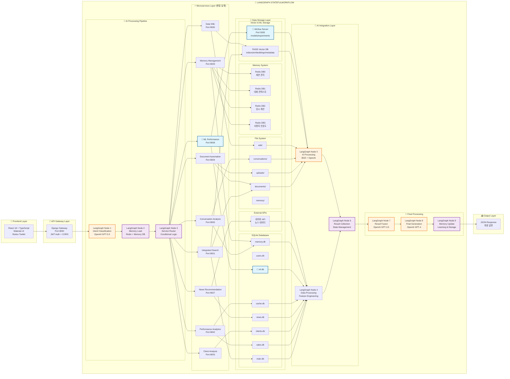
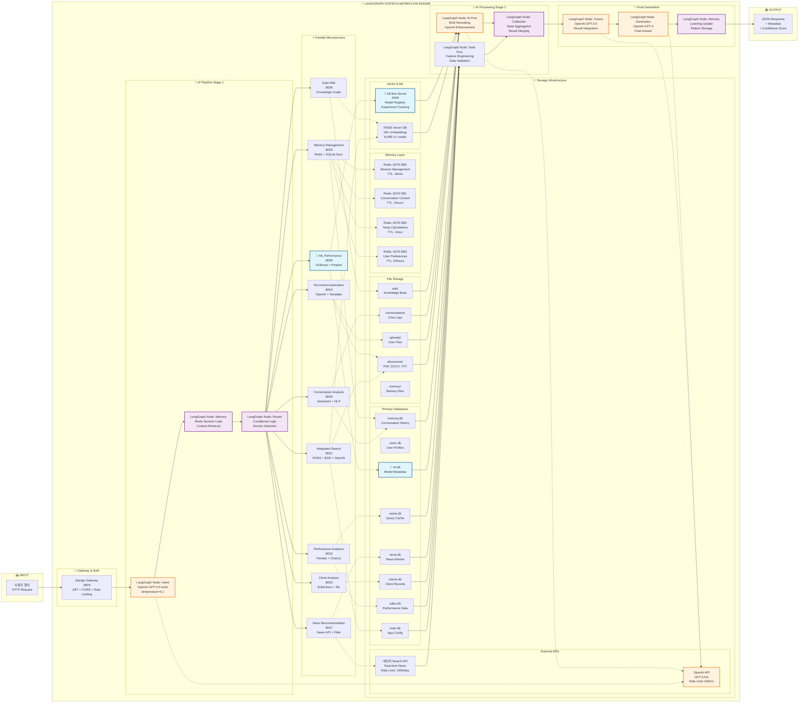
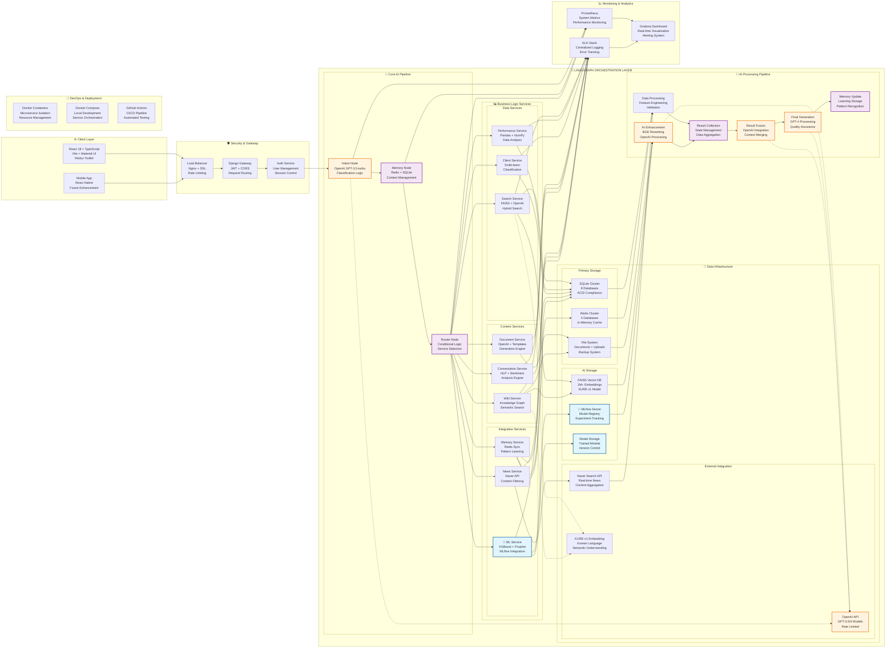

# 🏗️ 시스템 아키텍처 다이어그램 (System Architecture Diagrams)

## 📋 문서 개요

### 1.1 목적
의료업계 영업/관리용 QA 챗봇 시스템의 LangGraph 중심 아키텍처 시각화

### 1.2 범위
- 전체 시스템 아키텍처 다이어그램
- 상세 데이터 플로우 다이어그램  
- 기술 스택 및 인프라 구성 다이어그램
- 실제 요청 처리 플로우 다이어그램

### 1.3 LangGraph 역할
**LangGraph StateGraph = 전체 QA 시스템의 오케스트레이터**
- 복잡한 워크플로우 관리
- 10개 마이크로서비스 조율
- 상태 기반 데이터 전달
- 병렬 처리 및 조건부 라우팅
- AI 모델들과의 완벽한 통합

## 🏗️ 1. 상세 시스템 아키텍처

## 🔧 2. 상세 데이터 플로우 (포트 번호 포함)

## 🏗️ 3. 기술 스택 및 인프라 구성

## 🔄 4. 실제 요청 처리 플로우 (Step-by-Step)

```mermaid
graph LR
    subgraph "📥 Request Input"
        REQ[User Query<br/>ABC 회사 실적 분석해줘]
    end
    
    subgraph "🔄 LANGGRAPH STATE MANAGEMENT"
        direction TB
        
        subgraph "Step 1: Initial Processing"
            S1A[Django Gateway<br/>Port 8000<br/>✓ JWT Validation<br/>✓ Rate Limiting<br/>✓ CORS Check]
            S1B[LangGraph Init<br/>QAState 생성<br/>session_id 할당<br/>query 저장]
        end
        
        subgraph "Step 2: AI Classification"
            S2A[OpenAI GPT-3.5 Call<br/>temperature=0.1<br/>max_tokens=100<br/>Intent Classification]
            S2B[State Update<br/>intent: performance_analysis<br/>confidence: 0.95<br/>timestamp 기록]
        end
        
        subgraph "Step 3: Memory Loading"
            S3A[Redis Session Load<br/>DB0: session_data<br/>DB1: conversation_context<br/>DB2: temp_calculations]
            S3B[Memory DB Query<br/>user_profile 조회<br/>conversation_history 조회<br/>learned_patterns 조회]
            S3C[State Update<br/>user_context 추가<br/>previous_conversations 추가<br/>preferences 설정]
        end
        
        subgraph "Step 4: Service Selection"
            S4A[Router Logic<br/>intent=performance_analysis<br/>→ Performance Service 선택<br/>→ Client Service 선택]
            S4B[Parallel Execution<br/>Performance Analytics:8002<br/>Client Analysis:8003<br/>동시 실행]
        end
        
        subgraph "Step 5: Data Processing"
            S5A[Performance Service<br/>sales.db 쿼리<br/>ABC 회사 데이터 추출<br/>Pandas 데이터 처리]
            S5B[Client Service<br/>clients.db 쿼리<br/>ABC 회사 정보 추출<br/>등급 분류 실행]
            S5C[State Update<br/>performance_data 추가<br/>client_data 추가<br/>processing_time 기록]
        end
        
        subgraph "Step 6: AI Enhancement"
            S6A[BGE Reranking<br/>검색 결과 재정렬<br/>relevance_score 계산]
            S6B[OpenAI Enhancement<br/>데이터 해석<br/>인사이트 추출]
            S6C[State Update<br/>enhanced_results 추가<br/>ai_insights 추가]
        end
        
        subgraph "Step 7: Result Integration"
            S7A[Data Fusion<br/>performance_data + client_data<br/>correlation 분석<br/>trend 계산]
            S7B[Context Integration<br/>previous_conversations 반영<br/>user_preferences 적용]
            S7C[State Update<br/>integrated_results 생성<br/>context_applied 표시]
        end
        
        subgraph "Step 8: Final Generation"
            S8A[OpenAI GPT-4 Call<br/>temperature=0.7<br/>max_tokens=1000<br/>Final Answer 생성]
            S8B[Quality Check<br/>answer_quality 검증<br/>completeness 확인<br/>accuracy 점검]
            S8C[State Update<br/>final_answer 설정<br/>quality_score 기록<br/>generation_time 기록]
        end
        
        subgraph "Step 9: Memory Update"
            S9A[Redis Update<br/>session_data 갱신<br/>conversation_context 저장<br/>temp_results 저장]
            S9B[Memory DB Update<br/>conversation_history 추가<br/>user_patterns 업데이트<br/>performance_metrics 저장]
            S9C[Learning Update<br/>successful_patterns 기록<br/>user_feedback 예상<br/>improvement_areas 식별]
        end
    end
    
    subgraph "📤 Response Output"
        RESP[JSON Response<br/>answer: ABC 회사 분석 결과<br/>confidence: 0.95<br/>processing_time: 3.2s<br/>sources: sales.db, clients.db]
    end
    
    REQ --> S1A
    S1A --> S1B
    S1B --> S2A
    S2A --> S2B
    S2B --> S3A
    S3A --> S3B
    S3B --> S3C
    S3C --> S4A
    S4A --> S4B
    S4B --> S5A
    S4B --> S5B
    S5A --> S5C
    S5B --> S5C
    S5C --> S6A
    S6A --> S6B
    S6B --> S6C
    S6C --> S7A
    S7A --> S7B
    S7B --> S7C
    S7C --> S8A
    S8A --> S8B
    S8B --> S8C
    S8C --> S9A
    S9A --> S9B
    S9B --> S9C
    S9C --> RESP
    
    style S1B fill:#f3e5f5,stroke:#7b1fa2,stroke-width:2px
    style S2A fill:#fff3e0,stroke:#ef6c00,stroke-width:2px
    style S2B fill:#f3e5f5,stroke:#7b1fa2,stroke-width:2px
    style S3A fill:#f3e5f5,stroke:#7b1fa2,stroke-width:2px
    style S3B fill:#f3e5f5,stroke:#7b1fa2,stroke-width:2px
    style S3C fill:#f3e5f5,stroke:#7b1fa2,stroke-width:2px
    style S4A fill:#f3e5f5,stroke:#7b1fa2,stroke-width:2px
    style S5C fill:#f3e5f5,stroke:#7b1fa2,stroke-width:2px
    style S6B fill:#fff3e0,stroke:#ef6c00,stroke-width:2px
    style S6C fill:#f3e5f5,stroke:#7b1fa2,stroke-width:2px
    style S7C fill:#f3e5f5,stroke:#7b1fa2,stroke-width:2px
    style S8A fill:#fff3e0,stroke:#ef6c00,stroke-width:2px
    style S8C fill:#f3e5f5,stroke:#7b1fa2,stroke-width:2px
    style S9A fill:#f3e5f5,stroke:#7b1fa2,stroke-width:2px
    style S9B fill:#f3e5f5,stroke:#7b1fa2,stroke-width:2px
    style S9C fill:#f3e5f5,stroke:#7b1fa2,stroke-width:2px
```

## 📊 색상 코드 범례

### 🎨 컴포넌트 색상 구분
- **🟠 OpenAI 통합**: Intent Classification, AI Enhancement, Result Fusion, Final Generation
- **🟣 LangGraph State 관리**: Memory Load, Service Router, Result Collection, Memory Update
- **🔵 ML 관련**: ML Performance Service, MLflow, ML Database
- **🟢 데이터 저장소**: SQLite, Redis, File System, Vector DB
- **⚫ 기본 서비스**: 마이크로서비스들, Gateway, Frontend

## 🏗️ 시스템 구성 요약

### 📊 **핵심 컴포넌트**
- **Frontend**: React 18 + TypeScript + Material-UI
- **Gateway**: Django Gateway (:8000) + JWT Auth
- **Microservices**: 10개 FastAPI 서비스 (:8001-8009)
- **LangGraph**: StateGraph 워크플로우 오케스트레이션
- **AI Integration**: OpenAI GPT-3.5/4 + KURE-v1 + BGE
- **Storage**: SQLite(8개) + Redis(4개) + FAISS + MLflow
- **External**: 네이버 API + OpenAI API

### 🔄 **LangGraph 역할**
1. **상태 관리**: QAState를 통한 전체 데이터 흐름 제어
2. **워크플로우 제어**: 9단계 처리 과정 오케스트레이션
3. **병렬 처리**: 10개 마이크로서비스 동시 실행 관리
4. **조건부 라우팅**: Intent에 따른 적응적 서비스 선택
5. **AI 통합**: OpenAI 모델들과의 seamless 연동

### 🎯 **성능 및 확장성**
- **병렬 처리**: 독립적 서비스들의 동시 실행
- **메모리 최적화**: 숏텀(Redis) + 롱텀(Memory DB) 이중 구조
- **캐싱 전략**: 다층 캐시 시스템 (Redis + SQLite Cache)
- **모니터링**: Prometheus + Grafana + ELK Stack
- **CI/CD**: Docker + GitHub Actions

## 📝 문서 관리 정보

**파일명**: `08_system_architecture_diagrams.md`  
**생성일**: 2024-01-01  
**최종 수정일**: 2024-01-01  
**작성자**: AI Assistant  
**검토자**: System Architect  
**버전**: 1.0

### 📋 업데이트 이력
- **v1.0** (2024-01-01): 초기 아키텍처 다이어그램 생성
  - 상세 시스템 아키텍처 추가
  - 데이터 플로우 다이어그램 추가
  - 기술 스택 구성 다이어그램 추가
  - 요청 처리 플로우 다이어그램 추가

### 🔗 관련 문서
- [시스템설계서](./03_system_design.md)
- [API명세서](./05_api_specification.md)
- [데이터베이스설계서](./04_database_design.md)
- [기능명세서](./02_functional_specification.md)

---

**💡 참고사항**: 
- 모든 다이어그램은 Mermaid 형식으로 작성되어 GitHub, GitLab 등에서 자동 렌더링됩니다.
- 각 다이어그램은 독립적으로 복사하여 다른 문서에서도 사용할 수 있습니다.
- 시스템 변경 시 해당 다이어그램을 업데이트해주세요. 